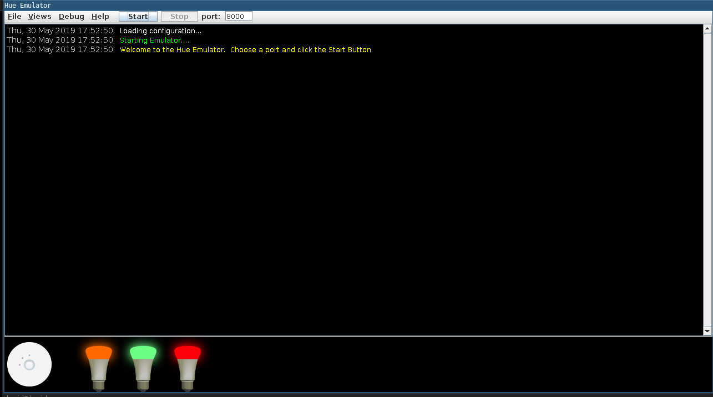

# Connecting to the light bulbs

There are no technical restrictions on the kinds of remote devices or APIs you can connect to with transports. For this lab, we will connect to a Philips HUE hub and make some colourful wireless light bulbs light up. If you (understandably) do not have physical devices available, you can use the Hue Emulator.

## Hue Emulator

Use `java -jar` with the emulator's filename to run it, for example:

```
david@davids:~$ java -jar ~/Downloads/HueEmulator-v0.8.jar
```

It does not produce any output on the command line, but a window pops up with a hub and a few predefined lights:



All you need now is to input a port (the default 8000 is usually fine) and click "Start" to activate the built-in server.

## Connecting to your hub

To connect to an actual hub, you need be able to access the bub on your network and get an API key. See the [Philips Developer docs](http://www.developers.meethue.com/documentation/getting-started) (registration required).


## Next up

Now that you have some lights up, you'll [create a module](./03-creating-a-new-module.md).
